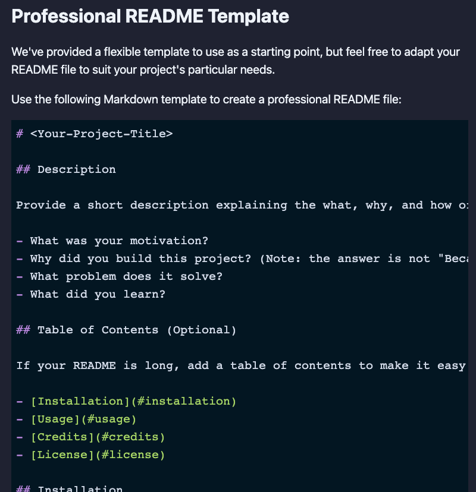

# professional README generator

## Description

What was your motivation?

- to create a README generator

Why did you build this project?

- so that I can quickly create a professional README for a new project

What problem does it solve?

- to save time creating a README file

What did you learn?

- to use the npm inquirer prompt and using node.js

## Table of Contents

1. [Installation](#installation)
2. [Usage](#usage)
3. [Credits](#credits)
4. [License](#license)

## Installation

undefined

## Usage

## Credits

Collaborators:
 
Ben Durham: [https://github.com/bdurham227]

Links:
 
no tutorials

## 🏆 License

https://choosealicense.com/licenses/mit/

MIT License Copyright (c) 2021 Takuya Matsumoto 

Permission is hereby granted, free of charge, to any person obtaining a copy
of this software and associated documentation files (the "Software"), to deal
in the Software without restriction, including without limitation the rights
to use, copy, modify, merge, publish, distribute, sublicense, and/or sell
copies of the Software, and to permit persons to whom the Software is
furnished to do so, subject to the following conditions:

The above copyright notice and this permission notice shall be included in all
copies or substantial portions of the Software.

THE SOFTWARE IS PROVIDED "AS IS", WITHOUT WARRANTY OF ANY KIND, EXPRESS OR
IMPLIED, INCLUDING BUT NOT LIMITED TO THE WARRANTIES OF MERCHANTABILITY,
FITNESS FOR A PARTICULAR PURPOSE AND NONINFRINGEMENT. IN NO EVENT SHALL THE
AUTHORS OR COPYRIGHT HOLDERS BE LIABLE FOR ANY CLAIM, DAMAGES OR OTHER
LIABILITY, WHETHER IN AN ACTION OF CONTRACT, TORT OR OTHERWISE, ARISING FROM,
OUT OF OR IN CONNECTION WITH THE SOFTWARE OR THE USE OR OTHER DEALINGS IN THE
SOFTWARE.

## Badges

## Features

If your project has a lot of features, list them here.
no features

## How to Contribute

If you created an application or package and would like other developers to contribute it, you can include guidelines for how to do so. The [Contributor Covenant](https://www.contributor-covenant.org/) is an industry standard, but you can always write your own if you'd prefer.
no package

## Tests

Go the extra mile and write tests for your application. Then provide examples on how to run them here.
no exmaples.

